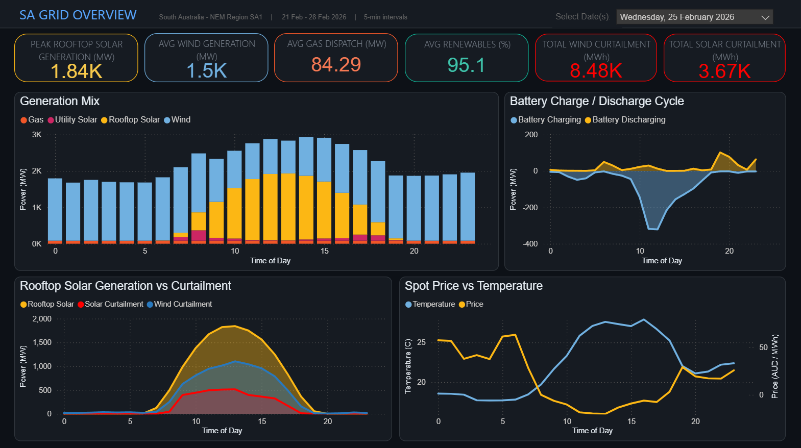
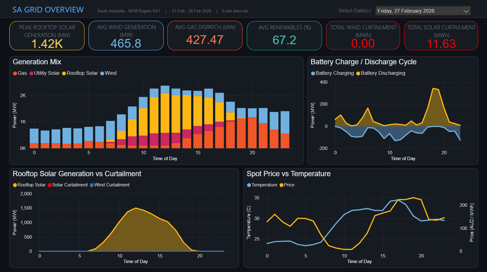

# SA Grid Analytics

South Australia has one of the most interesting electricity grids in the world. It's coal-free, heavily reliant on wind and rooftop solar, and regularly experiences negative electricity prices, meaning the grid is literally paying people to use power. As someone applying for graduate roles in the energy sector, I wanted to build something that went beyond a generic data project and helped me understand some of the energy challenges we face here.

This project pulls real SA electricity generation data from the OpenElectricity API , processes it through through python, loads and transforms it through a MySQL database, and visualises it in Power BI. The dashboard lets you explore how SA's grid behaves across different days like comparing a high-renewable Wednesday where solar drove prices to be negative against a low-wind Friday where gas stepped in to carry the load.

## Dashboard Analysis

**Wednesday, 25 February 2026 — High Renewable Day (95.1%)**

Wednesday the 25th was the strongest renewable day in the dataset at 95.1%, with gas averaging just 84 MW across the entire day. The data for this day presents a clear story on how SA's grid behaves on a high solar day.

From midnight through to around hour 6, the grid runs almost entirely on wind sitting between 1,600 and 1,735 MW with a small gas contribution at the base. Temperatures are low at around 18°C and prices are stable between $37 and $63/MWh. Notably, small amounts of wind curtailment are already occurring overnight between 17 and 34 MW, even before solar arrives, suggesting the grid has more wind than it needs even at low demand periods.

Around hour 6 as the sun rises, rooftop solar begins feeding into the local distribution network. This is hundreds of thousands of households simultaneously exporting surplus electricity onto the grid without any coordination. As solar ramps up through hours 7 to 10, prices fall sharply from around $63/MWh at hour 6 to exactly $0/MWh by hour 8 as the grid begins receiving more electricity than it needs.

Rooftop solar peaks at hour 13 at 1,842 MW. Despite temperatures climbing toward 27 to 28°C and air conditioners running, prices sit between negative $20/MWh through hours 11 to 15. The grid has more supply than it needs and is effectively incentivising consumption. Wednesday saw 8.48K MWh of wind curtailed during this period as AEMO actively reduced wind dispatch to manage the oversupply. Wind curtailment is high because rooftop solar has no central switch as AEMO has no control over individual household inverters so it can only curtail what it can actually dispatch.

As the sun moves west from hour 16 onwards, rooftop solar drops off and evening consumption picks up as people return home. Curtailment falls back to near zero and wind recovers to carry the evening load. Prices recover gradually through the evening settling between $17 and $29/MWh, kept in check by strong wind throughout the night. The battery chart shows a notable discharge response at hour 19 peaking at 101 MW as stored energy from the midday charging period feeds back into the grid.

**Friday, 27 February 2026 — Low Renewable Day (67.2%)**

Friday the 27th was the weakest renewable day in the dataset at 67.2%, with gas averaging 427 MW across the entire day which was five times higher than Wednesday. The contrast with Wednesday tells an important story about how differently SA's grid behaves when wind is low.

From midnight through to around hour 6, the grid is already under very different conditions to Wednesday. Wind is sitting between 470 and 600 MW, less than half of Wednesday's overnight levels, and gas is compensating heavily at around 165 to 275 MW. Prices are high overnight at $108 to $160/MWh, reflecting the grid's reliance on expensive gas generation from the very start of the day. Temperatures are also warmer overnight at around 23 to 24°C indicating more usage of air conditioning further driving the high price.

Around hour 6 as the sun rises, rooftop solar begins feeding into the network. As solar ramps up through hours 7 to 10, prices fall sharply from $131/MWh at hour 6 down to around $8/MWh by hour 10 as solar starts covering more of what gas was providing. Unlike Wednesday there is almost no curtailment as wind is too weak to create an oversupply situation, so the solar generation is absorbed without any intervention from AEMO.

Rooftop solar peaks around hours 11 to 12 at around 1,500 MW. Prices are sitting at around $8 to $35/MWh through this window and are positive rather than negative, because without strong wind there isn't enough total supply to create an oversupply. The curtailment chart is essentially flat all day with zero wind curtailment and negligible solar curtailment, confirming the grid was absorbing everything it could get.

From hour 13 onwards the situation deteriorates quickly. Solar starts declining while temperatures continue rising toward 34°C and evening consumption picks up. With wind too weak to fill the gap, gas ramps from around 100 MW at midday to over 1,100 MW by hour 19. Prices climb steeply from $78/MWh at hour 13 to over $230/MWh by hours 17 to 19 as the grid scrambles to meet peak evening demand with expensive gas generation. The battery chart shows a significant discharge spike peaking around hour 18 at 342 MW as batteries release stored energy at the exact moment prices are at their highest.

Friday shows the other side of SA's renewable grid. Without strong wind to complement solar, gas dominates from the first hour to the last, prices are volatile across the entire day rather than just the evening, and the absence of curtailment displays how on a low wind day the grid needs every megawatt it can get.

## Data Pipeline Process ##

The pipeline follows a structured ETL (Extract, Transform, Load) process, pulling live data from the OpenElectricity API through Python, storing it in MySQL, and transforming it through layered SQL views before Power BI consumes it.

**Extract**

Two separate Python scripts hit different OpenElectricity API endpoints. ingest_api.py calls the /v4/data/network/NEM endpoint requesting power and energy metrics grouped by fuel type for the SA1 region at 5-minute intervals over the past 7 days. ingest_market.py calls the /v4/market/network/NEM endpoint to pull wholesale spot price and demand for the same period. Both scripts authenticate using an API key stored in a .env file and never committed to version control.

Each script sends a GET request with the date range, interval, metrics and region as URL parameters. A successful 200 response returns JSON which is parsed and flattened from its nested structure into rows using a loop across the data blocks, result groups and individual observations.

**Transform**

The extracted rows are loaded into a pandas DataFrame. The timestamp column is converted from a string to a proper datetime object using pd.to_datetime(). The data is then pivoted using pivot_table() so that each metric (power, energy or price, demand) becomes its own column rather than separate rows, producing one clean row per timestamp and fuel type combination.

Column names are normalised using a chained pandas string operation through stripping whitespace, lowercasing, replacing spaces with underscores, removing special characters with regex, and collapsing double underscores, ensuring consistent naming before the data lands in MySQL.

**Load**

SQLAlchemy with the pymysql driver writes the cleaned DataFrame directly to MySQL using df.to_sql() with if_exists="replace" for a full refresh on each run. This creates two raw tables in the sapn_grid database — nem_energy for generation data and nem_market for price and demand.

**SQL Transformation Layer**

Two views are built on top of the raw tables in MySQL. v_sa1_base renames columns from the raw CSV-sourced nem_all table into clean readable names, acting as a single consistent source for all downstream logic. v_sa1_analysis builds on top of v_sa1_base and calculates all derived metrics: total renewables, total gas, total generation, renewable percentage using NULLIF to prevent division by zero, total curtailment, negative price flag, and time dimension fields including hour of day, day name and date only.

Power BI connects exclusively to v_sa1_analysis. No raw tables are exposed to the visualisation layer, keeping all business logic upstream in SQL.